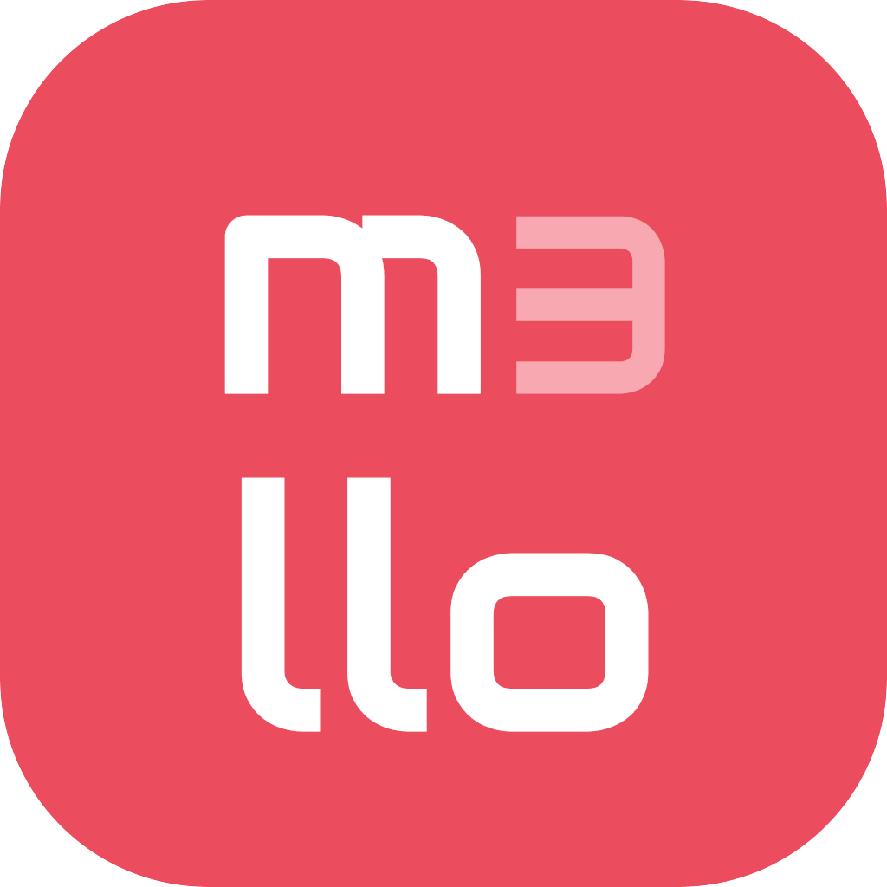

<p align="center">
  
</p>

<h1 align="center">m3llo</h1>

<p align="center">
  <strong>Voice and game streaming for your crew. Runs like it's not there.</strong>
</p>

<p align="center">
  <a href="https://m3llo.app">m3llo.app</a> &nbsp;·&nbsp;
  <a href="#quick-start">Quick Start</a> &nbsp;·&nbsp;
  <a href="#architecture">Architecture</a> &nbsp;·&nbsp;
  <a href="#contributing">Contributing</a> &nbsp;·&nbsp;
  <a href="#self-hosting">Self-Hosting</a>
</p>

<p align="center">
  
  
  
  
</p>

---

> [!WARNING]
> **m3llo is alpha software.** Many things are unfinished, broken, or missing entirely. Not recommended for anything you'd rely on. We're building in public and things will break. You've been warned, and we love you for being here anyway.

---

m3llo is a free, open-source voice and game streaming app for small groups of friends. Voice chat, game streaming, and text chat. That's the whole list.

Built in Rust and C++. Not because it's easy (we thought it would be easy, it wasn't), but because we don't want it affecting your FPS when in-game.

> **Official releases** are available on the [GitHub Releases](https://github.com/mollohq/mello/releases) page. Download the latest build for Windows or macOS there.

---

## Guiding principles

- **Performance is the feature.** Your GPU handles the stream. Your CPU barely notices. The voice pipeline adds no perceptible latency. Targets: `< 100MB install` · `< 80MB RAM in active voice` · `1080p60 stream` · `< 60ms WAN latency`
- **P2P by default.** Voice and streaming are direct peer-to-peer. No server in the middle unless your network forces a TURN relay as fallback.
- **P2P connections are DTLS 1.2 encrypted.** Signaling over WSS. Text chat is server-backed via Nakama, encrypted in transit.
- **Nothing extra.** No game store, no profile effects, no animated avatars. Scope is intentional and will stay that way.
- **Self-hostable.** The full client and backend is Apache 2.0. Run your own instance with no dependency on our infrastructure.

---

## Voice

- Peer-to-peer mesh topology, full mesh up to 6 participants per channel
- Under 50ms latency on typical home connections
- Opus codec at 48kHz, 20ms frames
- RNNoise for ML-powered noise suppression
- Silero VAD for voice activity detection, drives the speaking indicator in UI
- Speex AEC for echo cancellation
- DTLS 1.2 end-to-end encryption via libdatachannel

## Streaming

- 1080p60, hardware-encoded via NVENC, AMD AMF, or Intel QuickSync
- DXGI Desktop Duplication capture, zero-copy GPU pipeline (GPU texture to network, no system RAM touch)
- Under 1% CPU usage during active streams
- Under 20ms latency on LAN, under 60ms over WAN
- H.264 low-latency profile (no B-frames, CBR, 1-second VBV buffer)
- XOR FEC for loss recovery, quality degrades before stream lags
- Game audio captured via WASAPI loopback, Opus 128kbps stereo
- Game audio always flows to viewers regardless of host deafen state
- Up to 6 concurrent viewers P2P. Unlimited viewers available via m3llo.app streaming infrastructure add-on (self-hosters welcome)

## Everything else

- Text chat with GIF support
- Crew presence, see who is online and what they are playing
- Social login via Steam, Twitch, Google, Discord, Apple and more
- Multiple named voice channels per crew
- Speaking indicator driven by actual VAD, not mic level

---

## Quick Start

Building and running is supported on Windows and macOS. Contributions welcome for Linux and other platforms.

**Prerequisites:**

- Rust 1.75+
- CMake 3.20+
- Visual Studio 2022 (Windows) with C++ workload, or Xcode (macOS)
- Docker (for backend)

```bash
# Clone
git clone https://github.com/mollohq/mello.git
cd mello

# Start backend
cd backend && docker compose up -d

# Run client
cd .. && cargo run -p mello-client
```

Nakama console at `http://localhost:7351` (admin / admin)

Full setup and platform-specific notes in [/docs/getting-started.md](./docs/getting-started.md).

---

## Architecture

```
┌─────────────────────────────────────────────────────────────┐
│                         CLIENT                              │
│                                                             │
│   ┌───────────┐    ┌─────────────┐    ┌──────────────┐     │
│   │  Slint UI │    │ mello-core  │    │  libmello    │     │
│   │  (Rust)   │◄──►│  (Rust)     │◄──►│  (C++)       │     │
│   │           │    │             │    │              │     │
│   │  Native   │    │  App logic  │    │  Voice       │     │
│   │  UI       │    │  Nakama SDK │    │  Stream      │     │
│   │           │    │             │    │  Transport   │     │
│   └───────────┘    └─────────────┘    └──────────────┘     │
└─────────────────────────────────────────────────────────────┘
                              │
                              ▼
┌─────────────────────────────────────────────────────────────┐
│                         BACKEND                             │
│         Nakama (Auth, Chat, Presence, P2P Signaling)        │
│                        PostgreSQL                           │
└─────────────────────────────────────────────────────────────┘
```

### Voice pipeline

```
Mic
  → WASAPI capture
  → Speex AEC (echo cancellation)
  → RNNoise (noise suppression)
  → Silero VAD (voice activity detection)
  → Opus encode (48kHz, 20ms frames)
  → libdatachannel (P2P, DTLS encrypted)
  → Peer
```

### Video pipeline (zero-copy)

```
Game renders frame
  → DXGI Desktop Duplication (GPU texture, no copy to RAM)
  → Color conversion on GPU (BGRA to NV12)
  → Hardware encode (NVENC / AMF / QSV)
  → Network

Frames stay on GPU memory until they hit the network.
Result: under 1% CPU, under 20ms LAN latency.
```

### Stack

| Component | Technology | Notes |
|-----------|------------|-------|
| UI | [Slint](https://slint.dev) | Rust-native |
| Client logic | Rust | mello-core |
| Media layer | C++ | libmello |
| P2P transport | [libdatachannel](https://github.com/paullouisageneau/libdatachannel) | WebRTC, ICE, DTLS |
| Audio codec | Opus | BSD licensed |
| Noise suppression | RNNoise | BSD licensed |
| Voice activity | Silero VAD | MIT licensed |
| Backend | [Nakama](https://heroiclabs.com/nakama/) + PostgreSQL | Apache 2.0 |

---

## Project Structure

```
mello/
├── client/             # Slint UI (Rust)
├── mello-core/         # App logic (Rust)
├── mello-sys/          # FFI bindings (Rust)
├── libmello/           # Media layer (C++)
│   └── src/
│       ├── audio/      # Capture, VAD, AEC, noise suppression, Opus
│       ├── video/      # DXGI capture, hardware encode/decode
│       └── transport/  # WebRTC, ICE, DTLS
├── backend/
│   └── nakama/         # Server modules (Go)
└── specs/              # Design documents, read before contributing
```

---

## Contributing

Contributions are welcome.

**AI-assisted contributions are welcome.** We use AI tooling ourselves. Just make sure the output follows CLAUDE.md, comes with a proper spec, and you've actually read and understood what you're submitting. We review the result, not the method.

**Before opening a PR, read [CLAUDE.md](./CLAUDE.md).** It covers how the codebase is structured, what the agents expect, and how we work. Ignoring it wastes everyone's time.

**Every new feature needs a spec.** Look at `/specs` to see the format. A spec doesn't have to be long, but it needs to cover what, why, and the key constraints. No spec, no merge.

- Bugs: open an issue
- Ideas: start a discussion
- Code: PRs welcome, read specs first
- Docs: always needed

```bash
cargo fmt       # format
cargo clippy    # lint
```

---

## Self-Hosting

The full client and backend is Apache 2.0. For those of you who never really got over losing Ventrilo. For the tinkerers who need another project for that dusty Raspberry Pi in the drawer. We're one of you ourselves.

Full setup instructions in [/docs/self-hosting.md](./docs/self-hosting.md).

### Self-hosted vs m3llo.app

| | Self-hosted | m3llo.app |
|---|---|---|
| Voice and streaming | Up to 6 per channel | Up to 6 per channel |
| All other features | Identical | Identical |
| Scale beyond 6 | Optional add-on | Optional add-on |
| Your data | Stays on your hardware | Europe-based, GDPR |
| Setup | Your own hardware | Our cloud infrastructure |
| Cost | Free | Free |

The only real difference is scale. Self-hosted uses direct P2P connections, which caps concurrent participants at 6 per channel. m3llo.app offers an optional streaming infrastructure add-on for larger audiences. No mandatory subscription, no features held back to push you toward paid.

### Why 6 participants?

P2P means your stream goes directly to each viewer. With 6 viewers you are uploading 6 copies. Your upload bandwidth becomes the bottleneck fast. The cap is honest about that.

The add-on routes streams through our infrastructure, receiving once and relaying to all viewers. Same client, same quality, different plumbing.

---

## Community

We hang out on m3llo itself.

- **m3llo crew:** [m3llo.app/crew/m3llo](https://m3llo.app/crew/m3llo)
- **Reddit:** [r/m3llo_app](https://reddit.com/r/m3llo_app)
- **Bluesky:** [@m3lloapp](https://bsky.app/profile/m3lloapp.bsky.social)

---

## License

Apache 2.0. See [LICENSE](LICENSE).

Extended streaming limits for self-hosted instances require infrastructure not included in this repo. Available as an optional add-on at [m3llo.app](https://m3llo.app).

---

<p align="center">
  <sub>Made in Göteborg, Sweden by <a href="https://github.com/mollohq">Mollo Tech AB</a></sub>
</p>
