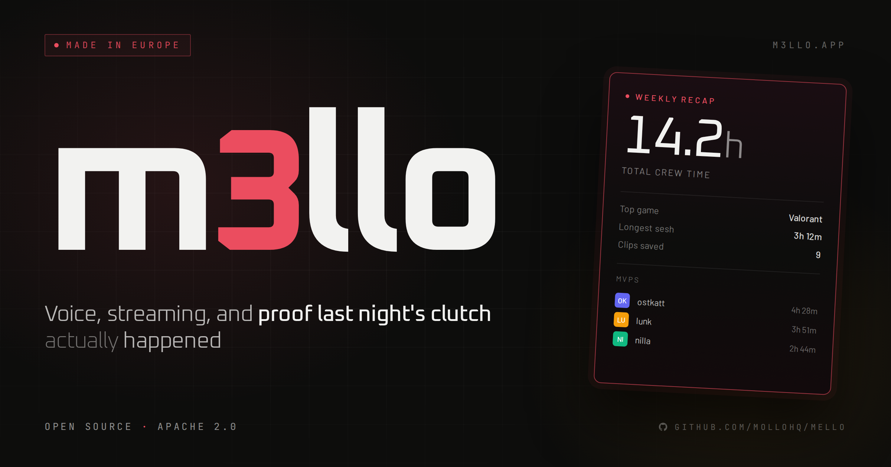
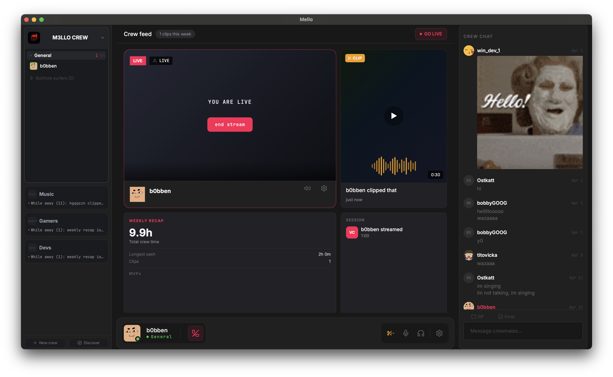

<p align="center">
  
</p>

<h1 align="center">m3llo</h1>

<p align="center">
  <strong>Voice, streaming, and proof last night's clutch actually happened.</strong>
</p>

<p align="center">
  <a href="https://m3llo.app">m3llo.app</a> &nbsp;·&nbsp;
  <a href="https://m3llo.app/vs/">Compare</a> &nbsp;·&nbsp;
  <a href="#download">Download</a> &nbsp;·&nbsp;
  <a href="#for-developers">For developers</a> &nbsp;·&nbsp;
  <a href="#self-hosting">Self-hosting</a>
</p>

<p align="center">
  
  
  
  
</p>

---

> [!WARNING]
> **m3llo is alpha software.** Many things are unfinished, broken, or missing entirely. Not recommended for anything you'd rely on. We're building in public and things will break. You've been warned, and we love you for being here anyway.

---

<p align="center">
  
</p>

## What is m3llo

App for gaming crews. Voice chat, game streaming, text chat and a crew feed that remembers what you did together. Perfect for crews up to 100 people. 100.000 member communities are probably better at Discord, but you're welcome to try it in m3llo ;)

Open source. Made in Europe. Apache 2.0.

- **Voice** that stays out of the way. Low latency, neural noise cancellation.
- **Stream** your screen at 1080p60. Hardware encoded on your GPU, your CPU stays with your game.
- **Chat** with markdown, replies, reactions, GIFs.
- **Crew feed** with clips, sessions, and a weekly recap. Come back tomorrow, the crew is still there.

For the longer version see **[m3llo.app](https://m3llo.app)** or the **[honest comparison](https://m3llo.app/vs/)** against Discord, TeamSpeak, Guilded, and Medal.

---

## Download

Grab the latest alpha build for your platform:

<p align="center">
  <a href="https://github.com/mollohq/mello/releases/latest/download/m3llo-win-x64-stable-Setup.exe">
    
  </a>
  &nbsp;
  <a href="https://github.com/mollohq/mello/releases/latest/download/m3llo-osx-arm64-stable-Setup.pkg">
    
  </a>
</p>

All releases, changelogs, and previous versions on the [Releases page](https://github.com/mollohq/mello/releases).

**Linux:** planned. Contributions welcome.

---

## Community

We hang out on m3llo itself.

- **m3llo crew:** [m3llo.app/crew/m3llo](https://m3llo.app/crew/m3llo)
- **Bluesky:** [@m3lloapp](https://bsky.app/profile/m3lloapp.bsky.social)
- **Reddit:** [r/m3llo_app](https://reddit.com/r/m3llo_app)
- **Issues:** [GitHub Issues](https://github.com/mollohq/mello/issues) for bugs and feature requests

---

# For developers

The rest of this README is for people who want to build m3llo from source, contribute, or run their own instance.

## Guiding principles

- **Performance is the feature.** Targets: `<100MB install` · `<80MB RAM in active voice` · `1080p60 stream` · `<60ms WAN latency`
- **Self-hostable.** The full client and backend is Apache 2.0. Run your own instance with no dependency on our infrastructure.
- **P2P as a first-class citizen for self-hosters.** Voice and streaming can be direct peer-to-peer. No server in the middle unless you wish.
- **UX matters as much as code.**

## Build from source

Building and running is supported on Windows and macOS. Contributions welcome for Linux and other platforms.

**Prerequisites:**

- Rust 1.75+
- CMake 3.20+
- Visual Studio 2022 (Windows) with C++ workload, or Xcode (macOS)
- Docker (for backend)

```bash
# Clone
git clone https://github.com/mollohq/mello.git
cd mello

# Start backend
cd backend && docker compose up -d

# Run client
cd .. && cargo run -p mello-client
```

Nakama console at `http://localhost:7351` (admin / admin)

Full setup and platform-specific notes in [/docs/getting-started.md](./docs/getting-started.md).

## Architecture

```
┌─────────────────────────────────────────────────────────────┐
│                         CLIENT                              │
│                                                             │
│   ┌───────────┐    ┌─────────────┐    ┌──────────────┐      │
│   │  Slint UI │    │ mello-core  │    │  libmello    │      │
│   │  (Rust)   │◄──►│  (Rust)     │◄──►│  (C++)       │      │
│   │           │    │             │    │              │      │
│   │  Native   │    │  App logic  │    │  Voice       │      │
│   │  UI       │    │  Nakama     │    │  Stream      │      │
│   │           │    │  client     │    │  Transport   │      │
│   └───────────┘    └─────────────┘    └──────────────┘      │
└─────────────────────────────────────────────────────────────┘
                              │
                              ▼
┌─────────────────────────────────────────────────────────────┐
│                         BACKEND                             │
│         Nakama (Auth, Chat, Presence, P2P Signaling)        │
│                        PostgreSQL                           │
└─────────────────────────────────────────────────────────────┘
```

Deep dives live in [`/specs`](./specs). Start with [`00-ARCHITECTURE.md`](./specs/00-ARCHITECTURE.md), then the pipeline specs for voice, video, streaming, and networking.

### Stack

| Component | Technology | Notes |
|-----------|------------|-------|
| UI | [Slint](https://slint.dev) | Rust-native |
| Client logic | Rust | mello-core |
| Media layer | C++ | libmello |
| P2P transport | [libdatachannel](https://github.com/paullouisageneau/libdatachannel) | WebRTC, ICE, DTLS |
| Audio codec | Opus | BSD licensed |
| Noise suppression | RNNoise | BSD licensed |
| Echo cancellation | WebRTC AEC3 + AGC2 | BSD licensed |
| Voice activity | Silero VAD | MIT licensed |
| Video decode | OpenH264 + dav1d | BSD licensed, no GPL |
| Backend | [Nakama](https://heroiclabs.com/nakama/) + PostgreSQL | Apache 2.0 |

## Project structure

```
mello/
├── client/             # Slint UI (Rust)
├── mello-core/         # App logic (Rust)
├── mello-sys/          # FFI bindings (Rust)
├── libmello/           # Media layer (C++)
│   └── src/
│       ├── audio/      # Capture, VAD, AEC, noise suppression, Opus
│       ├── video/      # DXGI capture, hardware encode/decode
│       └── transport/  # WebRTC, ICE, DTLS
├── backend/
│   └── nakama/         # Server modules (Go)
└── specs/              # Design documents, read before contributing
```

## Contributing

Contributions are welcome.

**AI-assisted contributions are welcome.** We use AI tooling ourselves. Just make sure the output follows CLAUDE.md, comes with a proper spec, and you've actually read and understood what you're submitting. We review the result, not the method.

**Before opening a PR, read [CLAUDE.md](./CLAUDE.md).** It covers how the codebase is structured, what the agents expect, and how we work. Ignoring it wastes everyone's time.

**Every new feature needs a spec.** Look at [`/specs`](./specs) to see the format. A spec doesn't have to be long, but it needs to cover what, why, and the key constraints. No spec, no merge.

- Bugs: open an [issue](https://github.com/mollohq/mello/issues)
- Ideas: start a [discussion](https://github.com/mollohq/mello/discussions)
- Code: PRs welcome, read specs first
- Docs: always needed

```bash
cargo fmt       # format
cargo clippy    # lint
```

---

## Self-hosting

The full client and backend is Apache 2.0. For those of you who never really got over losing Ventrilo. For the tinkerers who need another project for that dusty Raspberry Pi in the drawer. We're one of you ourselves.

Full setup instructions in [/docs/self-hosting.md](./docs/self-hosting.md).

### Self-hosted vs m3llo.app

|   | Self-hosted | m3llo.app |
|---|---|---|
| Voice and streaming | Up to 6 per channel | Up to 6 per channel (free), more as add-on |
| All other features | Identical | Identical |
| Your data | Stays on your hardware | EU-based, GDPR |
| Setup | Your own hardware | Zero setup |
| Cost | Free | Free, optional add-ons |

The only real difference is scale. Self-hosted uses direct P2P connections, which caps concurrent participants at 6 per channel. m3llo.app offers an optional infrastructure add-on for larger crews. No mandatory subscription, no features held back to push you toward paid.

### Why 6 participants on P2P?

P2P means your stream goes directly to each viewer. With 6 viewers you are uploading 6 copies. Your upload bandwidth becomes the bottleneck fast. The cap is honest about that.

The add-on routes streams through our infrastructure in Europe, receiving once and relaying to all viewers. Same client, same quality, different plumbing.

---

## License

Apache 2.0. See [LICENSE](LICENSE).

Extended streaming limits for self-hosted instances require infrastructure not included in this repo. Available as an optional add-on at [m3llo.app](https://m3llo.app).

---

<p align="center">
  <sub>Made in Göteborg, Sweden by <a href="https://github.com/mollohq">Mollo Tech AB</a></sub>
</p>