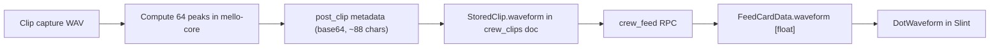

# Clip Card Waveform Redesign (Option A)

## Design: dot-matrix waveform

The waveform is a **dot-matrix display**: a strict grid of square amber "pixels" (each dot is one `Rectangle`), Nothing-style. Each column is one peak bucket; dots ignite **upward from a bottom baseline** (no mirroring). Silence is a faint dotted baseline; speech rises into columns. The waveform IS the card face — no gradient stage, no watermark, no separate scrub bar. Layout is identical at rest and during playback; it only changes state.

```
REST (hero)                                 PLAYING
┌──────────────────────────────────┐  ┌──────────────────────────────────┐
│ ✂ VOICE CLIP               0:30  │  │ ▮ PLAYING            0:12 / 0:30 │
│         · ▪      ·  ▪            │  │        · ▪     │·  ▪             │
│       · ▪ ▪ ·  · ▪ ▪ ▪  ·        │  │      · ▪ ▪ ·  ·│▪ ▪ ▪  ·         │
│ (▶)  ·▪·▪·▪·▪··▪·▪·▪·▪·▪··▪·     │  │     ·▪·▪·▪·▪··▪│▪·▪·▪·▪·▪··      │
│      ▔▔▔▔▔▔▔ baseline ▔▔▔▔▔▔     │  │      amber ────┤──── dim         │
│                                  │  │       (played) │ (remaining)     │
│ ostkatt clipped that             │  │ ostkatt clipped that             │
│ ◉◉◉  2h ago · Valorant           │  │ ◉◉◉  2h ago · Valorant           │
└──────────────────────────────────┘  └──────────────────────────────────┘
```

### Grid geometry
- **Hero card:** 64 columns x 15 rows, dots rising from a bottom baseline row. Dots are 3x3px squares, row pitch 5px (wave band 73px tall). Column pitch = wave width / 64; the dot stays 3px wide so the gutter breathes with card width. Lit dots = `1 + round(peak * 14)`; the baseline dot always renders.
- **Standard 1x1 card:** same 64 columns, 9 rows, 2x2px dots, row pitch 4px (wave band 36px).
- The grid is absolute: dots across columns align in perfect rows. No sub-pixel positions — every coordinate is an integer multiple of the pitch. This is what makes it read as a display, not a chart.

### Color and light
- **Rest:** lit dots `Theme.clip-amber` with a phosphor falloff — opacity `0.9 - (row-index-from-baseline / 14) * 0.45`. Base of a loud column glows, tips fade. Silent columns: baseline dot only, at 25%.
- **Playing:** played columns keep full amber (falloff intact); remaining columns switch to `Theme.text-dim` at 45%. The boundary is the playhead: a 1px white hairline spanning the full wave band, and the single column nearest it lights **white** (snapped to the grid — mechanical, not smeared).
- **Paused:** two-tone stays; the hairline breathes 100% -> 35% opacity on a 1.4s ease-in-out loop. Nothing else moves.
- **Hover (rest):** a ghost hairline at 30% white tracks the cursor, snapped to column pitch, with a mono time chip. Invitation to scrub before you even press play.
- No drop shadows, no gradients, no rounded dots. Flat `Theme.card-bg-inset` behind the wave.

### Motion (restraint)
- Dot color/opacity: `animate 120ms ease-out`. State changes (play, pause, seek) resolve as a quiet 120ms crossfade — no wiggle, no fake sin() animation. The real data is the show.
- Playhead hairline: 80ms linear x-animation between progress ticks (~60ms cadence) so playback motion reads continuous; **0ms while scrubbing** (1:1 with the pointer, snapped to columns).
- Play/pause icon crossfade 150ms. Nothing pulses except the paused hairline.

### Typography and chrome
- All timecodes (`0:12 / 0:30`, hover chip, duration badge) in **JetBrains Mono** (already in theme) — tabular, technical, Nothing-correct.
- `VOICE CLIP` micro-label: 10px / 700 / amber / 1.5px letter-spacing, scissors icon 10px.
- Play control: 44px circle (hero) / 24px (standard), transparent fill, 1.5px amber ring. Hover: fill amber 12%. Left of the wave on hero, corner on standard. Triangle/pause-bars icons as SVGs in `client/ui/icons/` per CLAUDE.md (no rectangle-drawn icons).
- Time chip while hovering/scrubbing: mono 10px amber on `#000000cc`, 3px radius, floats above the hairline, clamped to wave bounds.

### Performance budget
Dots render via `for i in lit-count` per column (Slint repeats over ints), so only lit dots exist: hero worst case ~960 rects, typical speech ~400; standard card ~250. One hero per feed — acceptable for the GPU renderer. Documented fallback if profiling disagrees: one full-height `Rectangle` per column with a hard-stop vertical gradient faking the dot pattern (64 rects total).

## Data flow



Pre-existing clips have no `waveform` field and render the low-opacity placeholder pattern permanently — accepted, user base is tiny.

## 1. Peak extraction (capture side, pure Rust)
- New `mello/mello-core/src/client/waveform.rs`: parse the 16-bit PCM WAV that `mello_clip_capture` writes, compute 64 max-abs peak buckets, normalize to the clip's own max, quantize to u8, base64-encode (~88 chars). No new dependencies — `base64` is already in mello-core's Cargo.toml.
- [clip.rs](mello/mello-core/src/client/clip.rs) `handle_capture_clip`: compute peaks after capture; add `waveform: String` to `Event::ClipCaptured` and pass it through `Command::PostClip` into `PostClipRequest` ([crew_events.rs](mello/mello-core/src/crew_events.rs) line 179).

## 2. Backend (Go)
- [clips.go](mello/backend/nakama/data/modules/clips.go): add `Waveform string` to `StoredClip` and accept it in the `post_clip` request (validate length <= 256 chars, reject otherwise). Size check: +~90 bytes/clip keeps the 250-entry `crew_clips` doc well under the 256KB Nakama limit (~170KB worst case).

## 3. Client plumbing
- [types.slint](mello/client/ui/types.slint): `FeedCardData` gains `waveform: [float]`.
- [handlers/clip.rs](mello/client/src/handlers/clip.rs): `build_feed_card` decodes the base64 `waveform` field into normalized floats; the optimistic `ClipCaptured` card carries the freshly computed peaks; `ClipPlaybackStarted` also sets a new `clip-duration-ms: int` property.

## 4. UI (crew_feed.slint)
- New `DotWaveform` component implementing the dot-matrix spec above. Inputs: `peaks: [float]`, `progress`, `playing`, `paused`, `rows`, `dot-size`; callbacks `seek(float)`, `scrub-preview(float)`. Owns the hairline, hover chip, and drag scrubbing (visual scrub position while pressed at 0ms, `seek()` committed on release; click seeks immediately). Empty `peaks` renders a fixed placeholder pattern at low opacity. Integer-aligned grid math; follow the CLAUDE.md fill-bar rule (`x: 0`, `clip: true`) for the chip and hairline positioning.
- `HeroClipCard`: delete the gradient stage, game watermark, fake `sin()` bars, and the separate 6px scrub bar. New layout: micro-label row (scissors + `VOICE CLIP` / `PLAYING`, mono timecode right-aligned), `DotWaveform` band with the 44px ring play button to its left, existing body (title, avatars, timestamp) below, unchanged. Card-face click still toggles play/pause; the waveform TouchArea sits on top and owns its region; clicking the wave while idle starts playback at that position (`play-clip` then `seek`).
- `ClipCard` (1x1): same `DotWaveform` at 9 rows / 2px dots, 24px corner play ring, existing body text.
- New icon assets: `play.svg` / `pause.svg` triangle and bars (stroke black, colorized in Slint) if not already present.
- Skeleton cards and `ChatClipCard` unchanged (chat card can adopt `DotWaveform` later — noted as follow-up).

## 5. Bug fixes (both pre-existing, required for good scrubbing)
- Pause state never syncs: set `clip_paused` true/false in [callbacks/clip.rs](mello/client/src/callbacks/clip.rs) `on_pause_clip` / `on_resume_clip`.
- Seek precision: `on_seek_clip` currently re-parses the "m:ss" display text (1s granularity). Use the new `clip-duration-ms` property instead.

## 6. Tests and gate
- Unit tests for WAV peak extraction (synthetic WAV: silence, full-scale, ramp).
- Testkit tests: `ClipCaptured` event produces a feed card with waveform data; pause callback sets `clip-paused`; seek emits exact `position_ms`. Prove each fails without its fix.
- Go test: `post_clip` persists and validates `waveform`.
- Run `./scripts/check-full.sh` (backend Go modules are touched).

## Explicitly out of scope
Legacy-clip waveform backfill, chat panel card restyle, iOS, spectrogram rendering, trim UI.