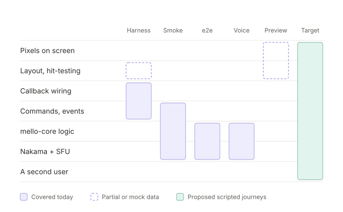
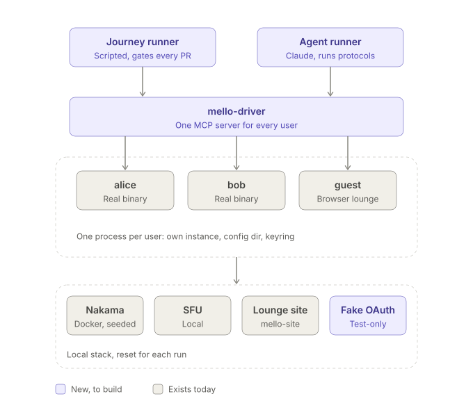
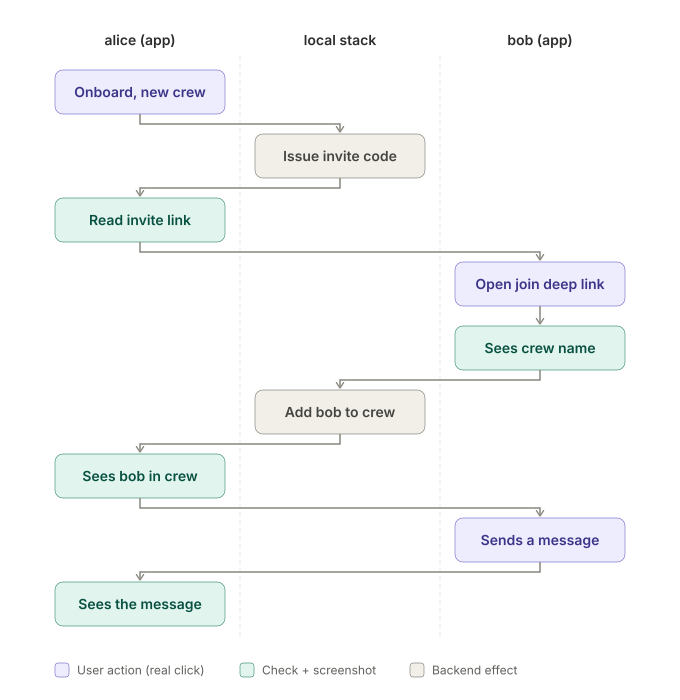
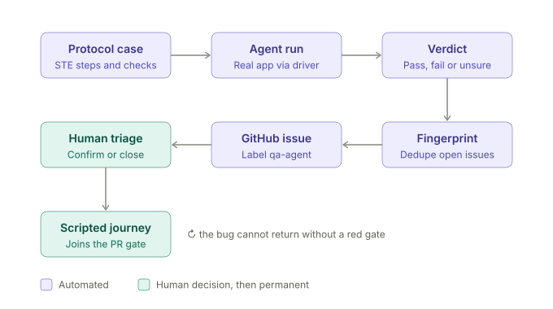
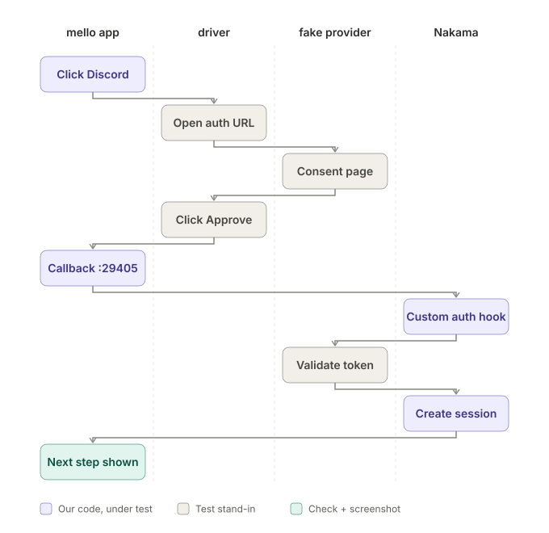

# E2E QA: Real-App Journeys and Agent Test Runners

> **Status:** Phase 0 in progress. macOS spike done 2026-09-24 (§14). Windows run and the 20-run gate are open.
> **Figures:** `plans/e2e-qa/*.svg`
> **Related:** [TESTING.md](../TESTING.md), [06-SOCIAL-LOGIN.md](../specs/06-SOCIAL-LOGIN.md),
> [CREW-INVITES.md](../specs/features/CREW-INVITES.md), [20-PERF-HARNESS.md](../specs/20-PERF-HARNESS.md)

---

## 1. Problem

The suite has many tests. A green suite does not prove that a user can finish a flow.

- The headless harness (`client/src/flow_tests.rs`) runs the real callback wiring.
  It injects synthetic core events. It has no backend and no pixels. It does not click.
- The signup smoke (`client/src/perf_mode.rs`) runs the real binary against a real backend.
  It sends `Command`s to the core directly. It does not press a button.
- `tools/e2e` tests backend RPCs only.
- No test uses two users. An invite needs two users.
- The UI has 0 `accessible-role` and 0 `accessible-label` on 181 `TouchArea`s.
  An external driver cannot find a control by its name.
- Since 2026-06-01, 25 commits are `fix(ui)`, `fix(client)` or `fix(onboarding)`.
  A person found each one by looking at the app.

## 2. Current Coverage

Each suite covers two or three adjacent layers. No suite covers all layers in one run.



## 3. Target Architecture

The plan has four parts. A flow catalogue (§9) links them.

1. **Addressable UI.** Every interactive element has a role and a label.
2. **`mello-driver`.** A small test-only port in the binary, and one external MCP server.
3. **Scripted journeys.** Deterministic user flows. They are the PR gate.
4. **Manual Test Protocol and agent runners.** Written test cases. Claude agents run them every night and file bugs.



The test layers, from fast to slow:

| Layer | Runs | Speed | Gates |
|---|---|---|---|
| Headless harness (exists) | Every commit | Seconds | `check.sh` |
| Scripted journeys | Every PR, nightly | Minutes | PR |
| Agent protocol runs | Nightly, before a release | 30–60 min | No. Files issues. |
| Human protocol pass | Before a release | 1–2 h | Release |

## 4. Part 1: Addressable UI

Add `accessible-role` and `accessible-label` to every interactive element.
The driver finds elements by label, for example "Join crew", "Invite" or "Mute".

- **Labels, not element IDs.** A label is the text that the user reads, so a refactor seldom changes it.
  Labels also give Narrator and VoiceOver support.
- **Gate.** A harness test in `check.sh` walks the element tree for each screen state in `all_states()`.
  The test fails when a `TouchArea` has no ancestor with a role and a label.
- **Order.** Label the P0 flows (§9) first. Then label the remaining panels.

## 5. Part 2: `mello-driver`

### 5.1 Inside the binary

All of this sits behind a new `e2e` cargo feature, the same pattern as `mcp` and `test-faults`.
Production builds do not contain it.

| Piece | Status | Purpose |
|---|---|---|
| Slint MCP server | Exists (`mcp` feature) | Click, type, screenshot, element tree. `click_element` sends real pointer events at the element's center (checked in `i-slint-backend-testing` 1.17.0, `search_api.rs`). A covered button fails, as it does for a user. |
| State port | New | JSON: current screen, onboarding step, `logged_in`, active crew, voice state, visible errors. A ring buffer of recent `Command`s and `Event`s. The log tail. |
| Faults | Reuse | `nakama_disconnect`, `sfu_disconnect`, `simulate_suspend` from `test-faults`. |
| Media injection | New | A WAV file as the capture device. A test pattern as the stream source. |
| Browser hook | New | Sends OAuth URLs to the state port instead of the system browser (§8). |
| Session file | Done (Phase 0) | `mello-core` feature `e2e-session`. The refresh token goes to `MELLO_E2E_SESSION_FILE`, not the OS keychain. A rebuilt binary otherwise blocks on a keychain prompt. |
| Endpoint overrides | New | Provider base URLs and the OAuth timeout from the environment (§8). |

`SLINT_EMIT_DEBUG_INFO=1` is set at build time for `e2e` builds. Without it, element queries return nothing.

The client reads a deep link only from `argv[1]`. The driver puts the deep link before `--instance`.

The state port lets `wait_for` wait on the real state. It never sleeps. `TESTING.md` requires this.

### 5.2 Outside the binary: `tools/mello-driver`

An MCP server over stdio. Both runners use it.

| Tool | Purpose |
|---|---|
| `stack_up`, `stack_reset`, `seed` | Start and reset the local stack (§5.3) |
| `launch(user, deeplink?)`, `restart(user)`, `kill(user)` | Start a user's app. `restart` tests session restore. |
| `click(user, label)`, `type(user, label, text)`, `key(user, key)` | Real input |
| `see(user)` | Screenshot plus a short element-tree summary |
| `state(user)`, `trace(user)` | State port contents, command/event trace |
| `wait_for(user, predicate, timeout)` | Wait on state. No sleeps. |
| `fault(user, kind)`, `backend_fault(action)` | Client faults and `dev_fault` RPC actions |
| `browser.*` | Headless browser for the guest lounge and the OAuth consent page |
| `oauth_script(provider, outcome)` | Sets the next fake-provider answer (§8) |

**Per-user isolation.** Each user has its own `--instance`, `MELLO_CONFIG_DIR` and `MELLO_SESSION_KEY`.
The signup smoke already uses all three.

**Why not OS-level screen control.** It is slow and needs OS permissions.
It cannot run in parallel, and it cannot read app state.
Use it only for OS surfaces: tray, notifications, installer, updater. Those stay in the human protocol.

### 5.3 The local stack

| Service | Source |
|---|---|
| Nakama + Postgres + MinIO | `backend/docker-compose.yml` (exists) |
| SFU | `mello-sfu` (exists) |
| Lounge site | `mello-site`, `npm run dev` (exists) |
| Fake OAuth provider | New, §8 |

The stack resets for each run. Journeys and agents never touch production.
The signup smoke stays the only check that runs against production.

## 6. Part 3: Scripted Journeys

A journey is a YAML file in `qa/journeys/`. It runs a real binary against the local stack, with one or more users.



```yaml
id: invite.accept-deeplink-cold
flow: INV-03            # ID in qa/flows.yaml
users: [alice, bob]
steps:
  - use: onboarding.new-crew    # reusable sub-journey
    user: alice
    crew: "Night Owls ${run_id}"
  - click: { user: alice, label: "Invite" }
  - read:  { user: alice, label: "Invite link", as: link }
  - launch: { user: bob, deeplink: "mello://join/${link.code}" }
  - wait:  { user: bob, state: "onboarding.step == 2", timeout: 15s }
  - see:   { user: bob, text: "Night Owls ${run_id}" }
  - click: { user: bob, label: "Join crew" }
  - wait:  { user: alice, state: "crew.members contains bob", timeout: 10s }
  - checkpoint: both      # screenshot + state dump into the artifacts
```

Rules:

- A step waits on state. A step never sleeps.
- A journey that fails once in 20 runs is broken. Fix it or delete it. Do not add retries.
- Journey screenshots are artifacts. They are not pixel goldens.
  Random avatars and animations make pixel diffs on live screens unstable.
- Pixel goldens apply to the panel `Preview` components (`slint-viewer --screenshot`).
  They use fixed mock data.
- Each run uploads screenshots, state dumps, traces and logs for each user.
- A new journey runs nightly first. After 14 days with zero flakes, it joins the PR gate.
- The self-hosted Windows and macOS runners run as a logged-in desktop session, not as a service.

## 7. Part 4: Manual Test Protocol and Agent Runners

### 7.1 The protocol

The protocol is in `qa/protocol/<feature>.md`, written in STE.
A person can run the same document before a release.

```markdown
### INV-03 · Accept an invite when the app is not running
Priority: P0 · Users: alice (member), bob (fresh install)
Preconditions: alice owns crew "Night Owls". bob has no config and no session.
Steps:
1. alice opens the invite modal and copies the link.
2. bob opens the link. The app is not running.
Expected:
- bob sees onboarding with "Night Owls" selected.
- bob finishes sign-up in 3 steps or less.
- alice sees bob in the member list within 5 s.
Look for:
- A white label on a white fill.
- A symbol shown as a box (tofu).
- A header strip that paints over a cut corner.
```

The "Look for" lines come from `CLAUDE.md` and `designs/design-system.html`.
A script cannot judge them. An agent that reads a screenshot can.

### 7.2 The agent runner

- One headless Claude agent for each protocol case. The agents run in parallel.
  Each agent uses `mello-driver` and gets its own users.
- Persona sessions explore without fixed steps. Examples:
  "a new player who got a link in Discord", "a returning user whose session expired",
  "a player on a bad network" (faults on).
- Every finding needs evidence: a screenshot, a state dump or a trace.
- Schedule: nightly on the self-hosted Windows runner, and on demand before a release.



### 7.3 Bug filing

Bugs go to GitHub issues in `mollohq/mello` with the labels `qa-agent` and `needs-triage`.

Each issue contains:

- The case ID, the build SHA and the OS.
- Screenshots and the state dump.
- The last 200 log lines and the command/event trace.
- The repro as a list of driver calls.

**Deduplication.** A fingerprint is the case ID, the failed check and the screen.
When an open issue has the same fingerprint, the agent adds a comment. It does not open a new issue.

**Rules:**

- An agent verdict never gates a PR. Agents are not deterministic. Only journeys gate.
- An "unsure" verdict goes to a human queue. It does not become an issue.
- A confirmed bug becomes a journey. The repro is already in driver calls, so this is mostly mechanical.

## 8. Social Login

### 8.1 How it works today

All providers use `OAuthFlow` in `mello-core/src/oauth.rs`.
The client starts a callback server on `127.0.0.1:29405` and opens the system browser.

| Provider | Browser flow | Who verifies the token | End to end with a fake? |
|---|---|---|---|
| Discord | Implicit. Token in the URL fragment. | Go hook calls `discord.com/api/users/@me` | Yes |
| Twitch | Implicit. Token in the URL fragment. | Go hook calls `api.twitch.tv/helix/users` | Yes |
| Steam | OpenID 2.0 | Go hook posts `check_authentication` to `steamcommunity.com` | Yes |
| Google | Code + PKCE. The client exchanges the code at `oauth2.googleapis.com`. | Nakama built-in `authenticate/google` checks the `id_token` signature | Probably. Phase 0 confirms (§8.4). |
| Apple | Not implemented on desktop. The client sends an empty token. | Nakama built-in | Test the "unsupported" message only |

### 8.2 What the fake covers

Yes, the tests can check our side of the flow, with a fake provider that answers "success".
Every mello step runs unmodified. Only the provider is a stand-in.



Covered:

- The UI: button, spinner, error message, next screen.
- The authorize URL: client ID, redirect URI, scopes, PKCE challenge.
  The fake refuses a wrong value, as the real provider does.
- The callback server, and the fragment JavaScript for Discord and Twitch.
  A real headless browser runs the JavaScript.
- PKCE: the fake checks the S256 challenge against the verifier.
- The Go hooks and account creation or linking, including `link_or_switch`.

### 8.3 The three seams

1. **Client provider URLs** (`e2e` feature only). The authorize URLs and the Google token endpoint come from `MELLO_E2E_OAUTH_BASE`.
   Production builds keep the constants.
2. **Client browser hook** (`e2e` feature only). `webbrowser::open` is replaced.
   The URL goes to the state port. The driver opens it in its headless browser and clicks Approve or Deny on the fake consent page.
3. **Backend: no code change.** In the e2e Docker profile, `extra_hosts` points `discord.com`, `api.twitch.tv`, `steamcommunity.com`
   and the Google key host to the fake provider. The Nakama container trusts a test CA.
   The Go hooks and the Nakama built-in run unmodified, with the real host names.

### 8.4 Google (answered in Phase 0)

Nakama 3.21.0 (`social/social.go`, `CheckGoogleToken`) behaves as follows:

- It fetches keys from `https://www.googleapis.com/oauth2/v1/certs` with a plain Go `http.Client`.
  The response is a map from key ID to a PEM X.509 certificate.
- It checks the RS256 signature and the issuer `accounts.google.com`.
- It requires `sub`, `azp` and `aud`. It does not compare `aud` with a client ID.

The fake serves a self-signed certificate at that path and signs its own `id_token`.
Go reads `SSL_CERT_FILE`, so the Nakama container trusts the test CA without an image rebuild.
Google is therefore testable end to end.

### 8.5 Cases

| Case | Fake behavior | Expected in the app |
|---|---|---|
| New identity | Approve | Account created. Onboarding continues. |
| Identity linked to another account | Approve, known ID | The `link_or_switch` path. Matches the spec. |
| User denies | `error=access_denied` | Error shown. Spinner stops. Buttons work again. |
| User closes the browser | No callback | Error after the timeout. Retry works. The timeout is short in `e2e` builds. |
| Provider rejects the token | Validation returns 401 | Error shown. No account created. |
| Provider is down | 500 | Error shown. No account created. |
| Second click during a flow | — | A clear error, or the first flow continues. No hang. |

Port 29405 is fixed. Two users cannot run a social login at the same time on one machine.
The driver runs OAuth steps one at a time.

### 8.6 What a fake cannot cover

- **Provider console configuration**: a valid client ID, a registered redirect URI, allowed scopes.
  A nightly probe requests the real authorize URL with our client ID and redirect URI.
  It checks that the provider does not show `invalid_client` or `redirect_uri_mismatch`. It does not sign in.
  Phase 2 finds which providers show these errors before sign-in.
- **Real consent with real accounts.** A person does one pass for each provider in the human release check.

## 9. Flow Catalogue and Coverage

`qa/flows.yaml` lists every user flow with an ID and a priority.
Each flow links to its harness tests, journeys and protocol cases.

P0 flows, first version:

| Area | Flows |
|---|---|
| Onboarding | Fresh install to first screen with each sign-up method; zero crews; discovery fails; crew is full; quit halfway and relaunch |
| Sign-in | Returning user; session restore; expired session; sign out, then sign in |
| Invites | Create and copy; accept by deep link (app running, app not running); guest in the web lounge; invalid code; full crew |
| Crew | Create; join from Discover; leave; settings (3 tabs); delete |
| Voice | Join; mute; deafen; switch channel; reconnect after a network drop |
| Chat | Send; reply; edit; delete; GIF; emoji |
| Stream | Start; watch as a second user; change quality; end |

The coverage report has two parts:

1. **Flow coverage.** For each flow: the layers that cover it, and the date of the last pass.
2. **Real-usage coverage.** The driver records each labelled element that a journey clicked,
   and each `Command` that a real click produced.
   The report lists the interactive elements that no journey touched.

## 10. Risks

| Risk | Plan |
|---|---|
| The `e2e` build is not the shipped build | The feature adds ports and changes no behavior. A CI check confirms that `production` builds contain no `e2e` symbols. The signup smoke stays the check on the shipped binary. |
| Windows-first | Phase 0 proves the Slint MCP server and multi-instance on Windows before other work starts. |
| Journey flakiness | Wait on state. Promote to the PR gate only after 14 clean days. |
| Agent noise | "Unsure" goes to a human queue. Fingerprints stop duplicates. Agents never gate. |
| No mic or GPU on CI | WAV capture and a test-pattern stream source. |
| Test data in production | Journeys and agents use the local stack only. |

## 11. Roadmap

| Phase | Work | Exit criterion |
|---|---|---|
| 0. Spike (about 3 days) — in progress, see §14 | Two instances, Slint MCP and a state port prototype on Windows and macOS. Run the invite flow by hand with `curl`. Confirm the Google key-host redirect (§8.4). | The invite flow passes 20 of 20 runs on both OSes |
| 1. Addressable UI | Labels on all interactive elements. The label gate in `check.sh`. `qa/flows.yaml` v1. | The gate is green. Every P0 flow is listed. |
| 2. Driver and journeys | `tools/mello-driver`, the journey runner, the fake OAuth provider, 8 P0 journeys, a nightly lane | 14 days with zero flakes, then the PR gate |
| 3. Protocol and agents | P0 protocol documents, the agent runner, issue filing with deduplication | One nightly run files real, reproducible issues |
| 4. Coverage and ratchet | Coverage report, `Preview` pixel goldens, a `CLAUDE.md` rule: "a UI change updates a journey or a protocol case" | A coverage number shows on every PR |

Proposed layout:

```
qa/
  flows.yaml
  journeys/*.yaml
  protocol/*.md
tools/
  mello-driver/
  fake-oauth/
```

## 12. Decisions

| # | Decision | Choice |
|---|---|---|
| 1 | How the driver finds elements | Accessibility labels |
| 2 | Where agent bugs go | GitHub issues in `mollohq/mello`, labels `qa-agent` and `needs-triage` |
| 3 | Where agents run | Self-hosted Windows runner, nightly, plus on demand |

Open. These need approval before Phase 2:

- **Headless browser for the driver.** Recommendation: Playwright with Chromium. This is a new dependency.
- **Language for `tools/fake-oauth`.** Recommendation: Go, next to Nakama in the e2e Docker profile.

## 13. Findings Outside Scope

This review found these items. They are not part of this plan.

| Finding | Effect |
|---|---|
| The OAuth flow has no `state` parameter | During the 120 s wait, any local web page can send a token to `127.0.0.1:29405`. Discord and Twitch have no PKCE. An attacker's identity can then be linked to the user's account. |
| Port 29405 is fixed | A second login attempt during the first fails with a server-start error. |
| Discord and Twitch use the implicit flow | OAuth 2.1 removes the implicit flow. Both providers support code + PKCE. |
| Apple sign-in is not implemented on desktop | The button sends an empty token. |

## 14. Phase 0 Results (macOS, 2026-09-24)

### 14.1 What works

| Check | Result |
|---|---|
| Two isolated instances on one machine | Works. Own `--instance`, config dir, session file, MCP port and state port. |
| Real clicks through Slint MCP | Works. `click_element` and `dispatch_key_event` drive onboarding, modals and text fields. |
| Read on-screen text | Works. `Text` elements expose `accessibleLabel`. Text inputs expose `accessibleValue`. |
| State port | Works. `GET /state` and `GET /events`. Journeys wait on state, not on sleeps. |
| Invite journey, scripted | Runs without a person in 42 s: `tools/mello-driver/spike/invite-journey.sh`. It fails at the join step because of bug 1 below. |
| Local stack | The existing Docker Nakama. Build time with a warm vcpkg cache: 2.5 min. |

### 14.2 What Phase 1 must fix in the driver

- **Anonymous elements.** The avatar tiles and many buttons have no ID. The spike used type names and position. Part 1 (labels) fixes this.
- **Text reads are slow.** One MCP call for each element: 25 s for a full screen. `mello-driver` must batch reads, or the state port must expose the needed text.
- **Keychain.** Fixed with `e2e-session`, above.
- **Gate coverage.** `check.sh` builds default features only. It does not lint or test the `e2e` code. Phase 2 adds an `e2e` lane to `check.sh`.

### 14.3 Bugs found by the spike

| # | Bug | Severity | Status |
|---|---|---|---|
| 1 | Join by invite code always fails. `join_by_invite_code` passes an empty username to `GroupUserJoin`, and Nakama 3.21 rejects it. Since 2026-03-21. Production is very likely affected. | P0 | Task started separately |
| 2 | Join failure during onboarding is silent. The modal closes and no error shows. | P0 | Part of task 1 |
| 3 | `Event::Error` is only logged. It never reaches the UI. Seven core paths end there, including voice channel create, rename and delete, and joining a crew. | P1 | Open |
| 4 | A fresh install opened from an invite link does not offer the invited crew at step 1. The user must create or join another crew first. The join modal then opens on top of step 3. | P1 | Open, to fix later |
| 5 | Session restore blocks the core command loop while the keychain prompt waits. The window stays blank. | P1 | Open |
| 6 | A returning device user with a lost session goes back to "Discover your crew". The account already owns a crew. | P2 | Open, needs a product decision |
| 7 | Step 1 for a returning user shows two "Sign in" controls: the pill and the old link. | P2 | Open |
| 8 | The returning-user pill and its round avatar break the design system shapes. A person is an octagon. A button cuts two corners. | P3 | Open |
| 9 | Loading history for a new crew logs `400 Invalid channel ID`. | P3 | Open |
| 10 | Step 3 shows an Apple button. Desktop Apple sign-in is not implemented. | P3 | Open |

Suspect, not confirmed: after onboarding, `active-crew-name` is empty while `active-crew-id` is set.
`main.slint` uses it for the "back to" label in the stream view.

### 14.4 Open for Phase 0 exit

- Run the same journey on the Windows self-hosted runner.
- 20 of 20 passes, after bug 1 is fixed.
