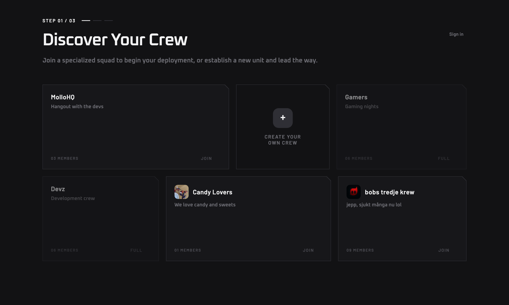
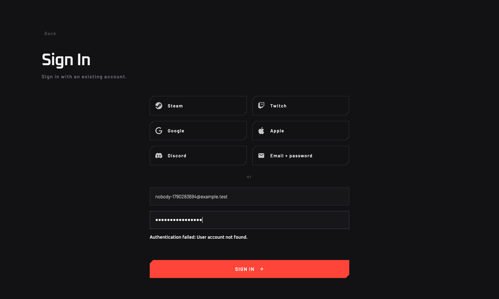
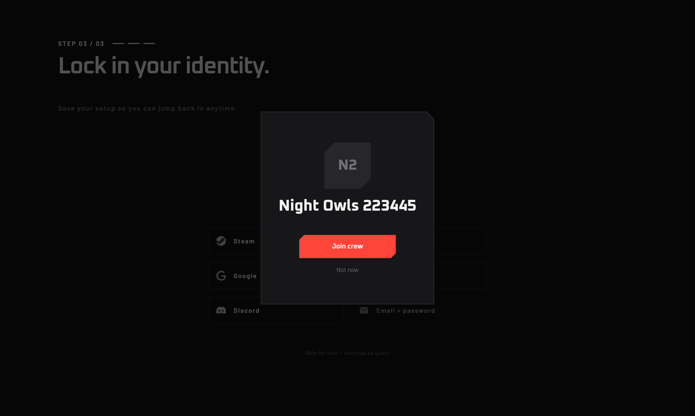
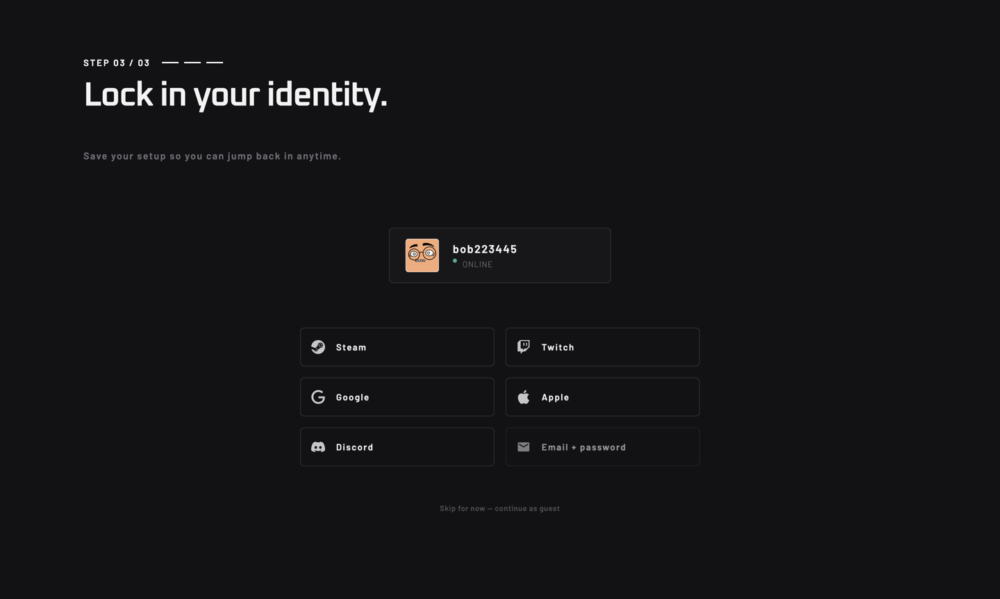
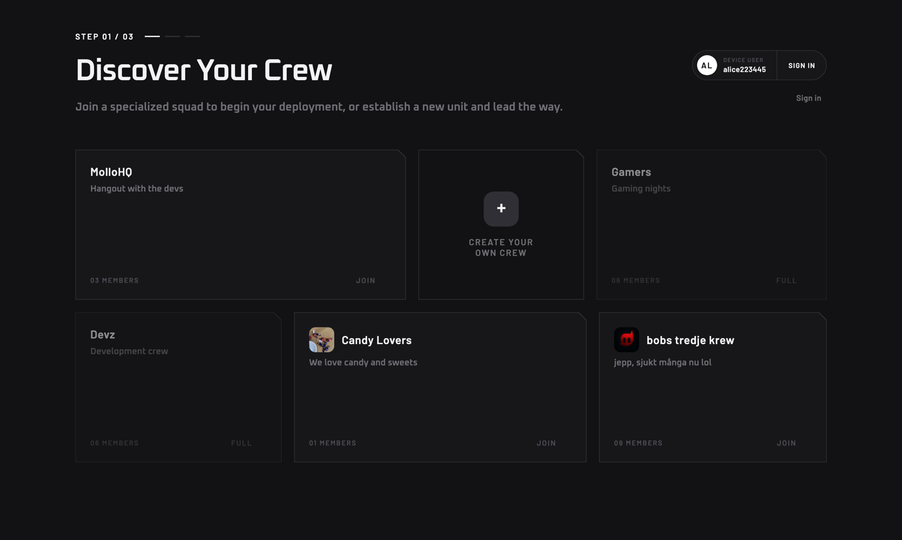
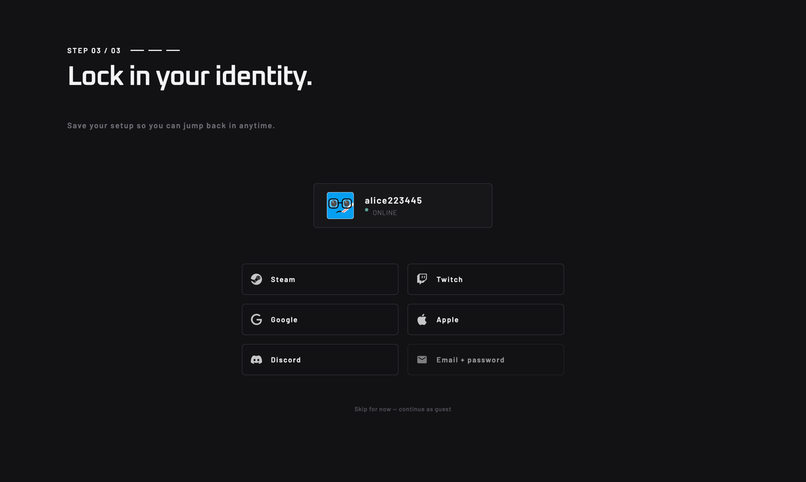
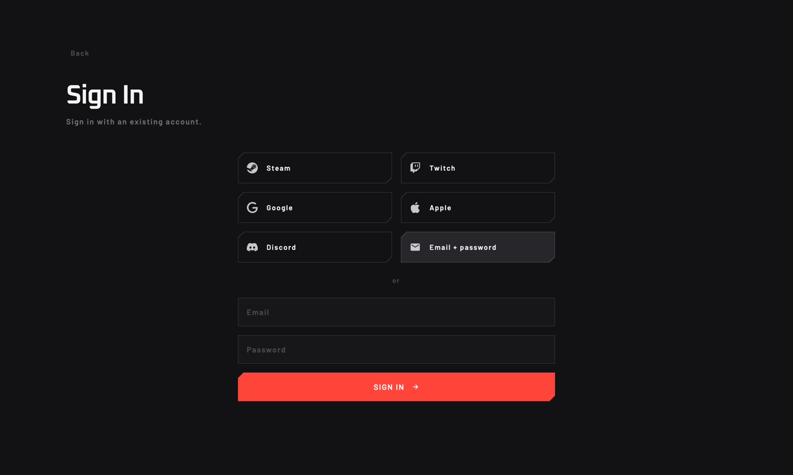
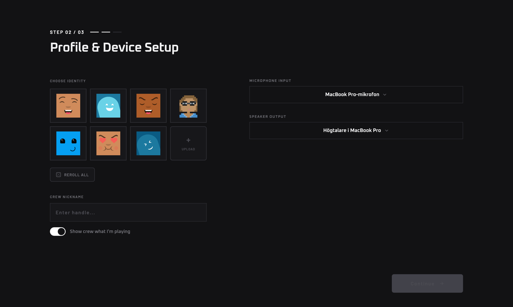

# Phase 0 Findings: UI and Design System (2026-09-24)

> **Source:** Phase 0 spike, macOS, local stack, `feat/e2e-qa` build with `--features development,e2e`.
> **Driver:** `tools/mello-driver/spike/`. Every step below is a real click through Slint MCP.
> **Plan:** [plans/E2E-QA.md](../../../plans/E2E-QA.md) §14 lists the functional bugs.
> **Design rules:** `designs/design-system.html` §05 Components.

Screenshots are in this folder. Each is 1440 px wide.

## Summary

| ID | Title | Area | Severity |
|---|---|---|---|
| UI-1 | "Sign in" on a fresh install is a dead end | Onboarding | P1 |
| UI-2 | An invite link does not offer the invited crew at step 1 | Onboarding, invites | P1 |
| UI-3 | A failed join closes the modal with no error | Invites | P0 (with the backend bug) |
| UI-4 | A returning user sees two "Sign in" controls | Onboarding | P2 |
| UI-5 | A returning device user with a lost session goes back to step 1 | Onboarding | P2, needs a decision |
| UI-6 | The Apple button shows on desktop, where it cannot work | Onboarding, sign-in | P3 |
| UI-7 | "Email + password" looks disabled on step 3 | Onboarding | P3 |
| UI-8 | The "or" divider in the email sign-in form is wrong | Sign-in | P3 |
| DS-1 | Onboarding buttons are rounded; buttons must cut two corners | Design system | P2 |
| DS-2 | The returning-user control is a pill | Design system | P3 |
| DS-3 | People are circles and rounded squares; a person is an octagon | Design system | P3 |
| DS-4 | The "+" tile in "Create your own crew" is a rounded square | Design system | P3 |

---

## UI-1 · "Sign in" on a fresh install is a dead end

**Severity:** P1. A beta user reported this loop.

**Steps:**
1. Start a fresh install. Step 1, "Discover Your Crew", shows.
2. Click "Sign in" (top right). The sign-in panel shows.
3. Use any method with an account that does not exist.
   Example: "Email + password" with a new address.
4. The panel shows "Authentication failed: User account not found."
5. Click "Back". Step 1 shows. "Sign in" is still the most visible text control.
6. Go to step 2.

**Result:** The user goes round the loop. No screen says "you are new: pick or create a crew below".
With a social provider, each loop also goes out to the browser and back.

**Other defects on this path:**
- The error is the raw server text. It gives no next action.
- `login-error` stays set after "Back". The state port shows it on step 1.

**Expected (Human Operator, 2026-09-24):**
"Sign in" shows only for a returning user. A returning user is a user who logged out, or whose session restore failed.
On a fresh install, onboarding step 1 has no "Sign in" control.

**Open question:** How does a user with an account sign in on a new computer?
Today, step 3 does it: linking an identity that belongs to another account switches to that account (`link_or_switch`, `mello-core/src/client/auth.rs`).
But the user first creates a crew and a device account in steps 1–2. Those stay behind as orphans.

**Code:** `client/ui/panels/onboarding.slint` (`signin-link-touch`, about line 585), `client/ui/main.slint` (`open-sign-in`, `SignInPanel`, about line 733).

---

## UI-2 · An invite link does not offer the invited crew at step 1

**Severity:** P1.

**Steps:**
1. User A creates a private crew and copies the invite link.
2. User B (fresh install) opens `mello://join/<code>`.

**Result:** Step 1 shows the public crews. The invited crew is not there, because it is private.
B must create or join another crew, pick an avatar, and reach step 3.
Then a "Join crew" modal for the invited crew opens on top of step 3.

**Expected:** Step 1 shows the invited crew first, preselected. B joins it as part of onboarding.

**Code:** the pending deep link is sent only from `OnboardingReady` or `LoginSuccess` (`client/src/handlers/auth.rs`, `dispatch_pending_deep_link`).

---

## UI-3 · A failed join closes the modal with no error

**Severity:** P0 together with the backend bug. The separate fix task covers both.

**Steps:** As UI-2. Click "Join crew".

**Result:** The server returns `failed to join crew`. The modal closes. Step 3 shows. There is no error.
The client raises `Event::Error`, and the UI only logs it (`client/src/handlers/mod.rs`).

**Expected:** The modal stays open and shows the error.

---

## UI-4 · A returning user sees two "Sign in" controls

**Severity:** P2.

**Steps:** Start as a returning device user whose session restore failed (see UI-5).

**Result:** Step 1 shows the returning-user control ("DEVICE USER … | SIGN IN") and, below it, the "Sign in" text link.

**Expected:** One control.

---

## UI-5 · A returning device user with a lost session goes back to step 1

**Severity:** P2. This needs a product decision.

**Steps:**
1. Finish onboarding as a device user, and create a crew.
2. Remove the saved session. (In the spike, a new build could not read the keychain.)
3. Start the app.

**Result:** Device auth logs in as the same account (`created=false`).
The UI goes to step 1, "Discover Your Crew", with `logged_in` false and no crews.
The account already owns a crew.

**Expected (proposal):** When device auth returns an existing account that finished onboarding, go to the app.

**Code:** `client/src/onboarding.rs`: `(_, RestoreFailed | LoggedOut) => PickCrew`. `Event::DeviceAuthed` only sets `is-returning-user`.

---

## UI-6 · The Apple button shows on desktop, where it cannot work

**Severity:** P3.

**Result:** Step 3 and the sign-in panel both show "Apple". Desktop Apple sign-in is not implemented.
The button sends an empty token, and the handler answers "Apple sign-in isn't available here".

**Expected:** Hide the button until desktop Apple sign-in exists.

---

## UI-7 · "Email + password" looks disabled on step 3

**Severity:** P3.

**Result:** The button has `subdued: true`, which sets opacity to 0.6. Next to five buttons at full opacity, it reads as disabled.
The same button in the sign-in panel is at full opacity.

**Expected:** One treatment for all six buttons. The design system has a disabled state. De-emphasis must not look like it.

---

## UI-8 · The "or" divider in the email sign-in form is wrong

**Severity:** P3.

**Result:** Clicking "Email + password" opens the email form below the buttons, after an "or" divider.
The form is the result of that button, not an alternative to the buttons.

**Expected:** Remove the divider, or show the form in place of the buttons.

---

## DS-1 · Onboarding buttons are rounded; buttons must cut two corners

**Severity:** P2. This is the most visible design-system break in onboarding.

**Rule:** Buttons cut the top-left and bottom-right corners, 10 px (`--cut`).

**Result:** `onboarding.slint` defines its own `AccentButton` and `AuthButton` with `border-radius: Theme.r-inner` (6 px).
`sign_in.slint` defines components with the same names that use `CutButtonShape`.
The six identity buttons therefore have rounded corners on step 3 and cut corners in the sign-in panel.

Other rounded buttons in `onboarding.slint`: upload and reroll (about lines 1149, 1213), the email form back and link buttons (about lines 1693, 1732), and the retry and pill buttons (about lines 750, 786).

**Expected:** One shared `AccentButton` and `AuthButton`, built on `CutButtonShape`, used by both panels.
The duplicate component names also make driver IDs ambiguous (`AuthButton::auth-touch` exists in both files).

---

## DS-2 · The returning-user control is a pill

**Severity:** P3.

**Rule:** The 999 px radius (`--r-pill`) is for status dots and play discs only.

**Result:** The "DEVICE USER … | SIGN IN" control uses `border-radius: 999px` (`onboarding.slint`, about line 615).

**Expected:** It is a button, so it cuts two corners.

---

## DS-3 · People are circles and rounded squares; a person is an octagon

**Severity:** P3.

**Rule:** People cut all four corners.

**Result:**
- The "AL" avatar in the returning-user control is a circle (32 px, radius 16 px; `onboarding.slint`, about line 633).
- The avatar on the step-3 identity card is a rounded square.
- `AvatarFallback` uses a 12 px or 6 px radius (`onboarding.slint`, about line 243).

**Expected:** The octagon, as in the main app's control bar.

---

## DS-4 · The "+" tile in "Create your own crew" is a rounded square

**Severity:** P3.

**Rule:** Icon buttons and tiles cut corners. Radii survive only on dots, discs and pips.

**Result:** The "+" tile uses `border-radius: 16px` (`onboarding.slint`, about line 209).

---

## Suspect, not confirmed

- After onboarding, `active-crew-name` is empty while `active-crew-id` is set.
  `main.slint` uses it for the "back to" label in the stream view. Check with a stream journey.
